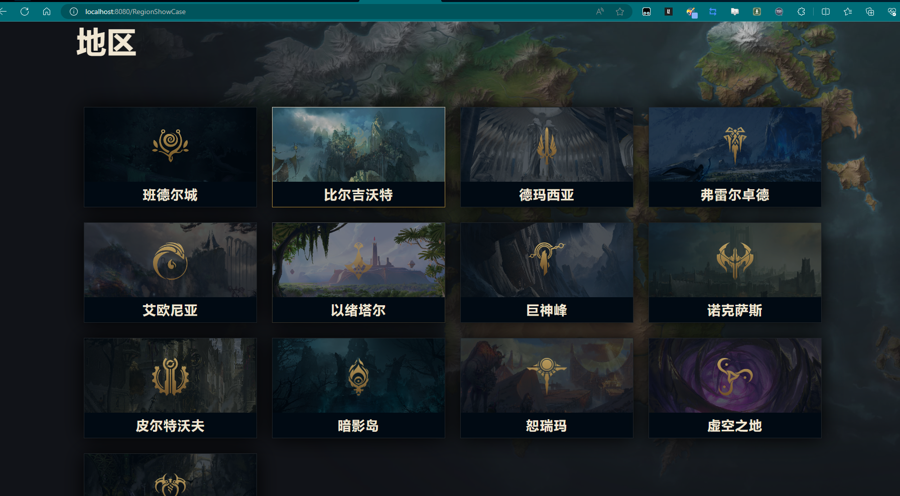

## "# Universe_of_League_of_Legends_parody" 

### “《英雄联盟》宇宙”仿写


前端使用vue3框架使用了包括 Vuex、Vue router、axios等技术实现，后端使用spring boot以及mybatis等框架实现。目前项目还不够完善，本人还在持续更新中（更新速度不会太快，因为本人也在学习中），眼下完成的功能大概有：前端的英雄及相关页面：介绍页、传记页的开发，地区及相关页面：介绍页的开发；后端的英雄、地区、种族、职业等实体的构造以及持久层的实现，以及控制层实现，基本上前端需要使用的接口api都有预留。

The front-end uses the vue3 framework using technologies including Vuex, Vue router, axios and other technical implementations, and the back-end uses spring boot and mybatis and other frameworks. At present, the project is not perfect, I am still continuing to update (the update speed will not be too fast, because I am also learning), the functions completed at the moment are: front-end heroes and related pages: development of introduction pages, biography pages, regions and related pages: development of introduction pages; The construction of entities such as heroes, regions, races, and professions in the backend, as well as the implementation of the persistence layer, as well as the implementation of the control layer, basically the interface APIs that the front-end needs to use are reserved.

### 前端运行 （Run Frontend）

前端的vue项目使用vue cli创建的所以开发环境下建议使用一下代码运行前端：

The front-end vue project is created using vue cli, so it is recommended to use the following code to run the front-end in the development environment:

```shell
vue serve
```

生产环境请使用：

For production environments, use:

```shell
vue build
```


### 后端运行 （Run backend）

开发环境下：建议使用IDEA运行（本人的建议哈）先删掉文件夹中的idea文件夹然后打开项目直接运行LeagueOfLegendsUniverseBackendApplication即可。

Development environment: It is recommended to use IDEA to run (my suggestion), first delete the idea folder in the folder, and then open the project to run LeagueOfLegendsUniverseBackendApplication directly.


### 数据库配置（Database configuration）

数据库结构及数据我已经导出，根目录下league_of_legends_universe_db.sql直接导入即可，记得创建一个数据库再导入 （如果不想修改的话可以直接命名为“league_of_legends_universe_db”）

I have exported the database structure and data, you can import it directly league_of_legends_universe_db.sql the root directory, remember to create a database and then import it (if you don't want to modify it, you can directly name it "league_of_legends_universe_db")


### 可能遇到的问题（Problems you may encounter）

前端（frontend）

1.依赖问题（Dependency issues）：

请确保前端的相关依赖已经正确安装（可以全局或者项目内安装）例如：axios、vuex、vue-router等。

Make sure that the dependencies on the frontend are installed correctly (either globally or within the project) such as axios, vuex, vue-router, etc.

后端（backend）

1.端口占用问题（Port occupancy issues）：

如果发现8089端口占用问题，可以从后端配置文件application.yml中修改端口（切记修改后前端也需要修改，因为本人还不太会从前端将所有api请求映射到同一个路径中 所以前端向后端的请求都是写的完整路径）。

If you find port 8089 occupancy problems, you can modify the port from the backend configuration file application.yml (remember that the frontend also needs to be modified after the modification, because I am not very good at mapping all API requests from the frontend to the same path, so the requests from the frontend to the backend are the full path written).


### 效果




